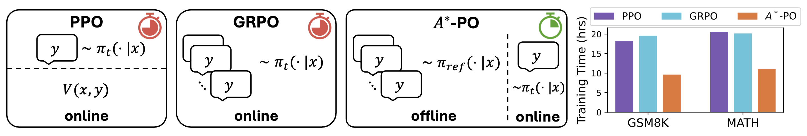
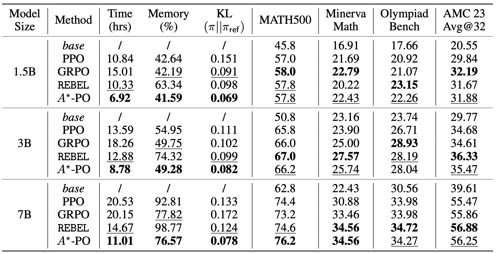

<h1 align="center">Accelerating RL for LLM Reasoning with Optimal Advantage Regression</h1>

<div>
<br>

<div align="center">

[](https://github.com/ZhaolinGao/A-PO)
[](https://arxiv.org/abs/2505.20686)
[](https://huggingface.co/collections/Cornell-AGI/accelerating-rl-for-llm-reasoning-with-optimal-advantage-reg-6838c9ff402ef780fdb23638)

</div>

</div>

Recent advances in LLMs, including **OpenAI-o1 and DeepSeekR1**, have demonstrated the remarkable effectiveness of reinforcement learning (RL) with rule-based rewards. However, methods like **GRPO and PPO** require explicit critics or multiple generations per prompt, resulting in high computational and memory costs.

***Can we develop simpler and more efficient RL
algorithms for long context reasoning?***

---

### 🔥 **$A^\star$-PO** — **Policy Optimization via Optimal Advantage Regression**

A new RL algorithm for LLMs that first estimates the optimal value function **offline** via sampling from reference policy, then performs **on-policy** updates with just **1 generation per prompt**.

<p align="center"></p>

***⚡ Matches or beats PPO/GRPO while reducing training time by up to 2× and peak memory usage by over 30%.***

---

## Installation
```bash
conda create -n apo python=3.10
conda activate apo
pip3 install vllm==0.6.3 # or you can install 0.5.4, 0.4.2 and 0.3.1
pip install -e . # verl
pip3 install flash-attn --no-build-isolation # flash attention 2
pip install wandb
```

## Datasets

### Preprocessing

```bash
# gsm8k
python ./preprocess/data_preprocess/gsm8k.py
# math
python ./preprocess/data_preprocess/math.py
```

### Offline Generation

To estimate the optimal value function, we generate 8 responses per prompt with the reference model and gather the reward. Our generated data can be found on huggingface:

<table>
  <tr>
    <td>Qwen2.5-1.5B</td>
    <td><a href="https://huggingface.co/datasets/Cornell-AGI/gsm8k_size_qwen2.5_1.5b_eval">GSM8K</a></td>
    <td><a href="https://huggingface.co/datasets/Cornell-AGI/math_size_qwen2.5_1.5b_eval">MATH</a></td>
  </tr>
  <tr>
    <td>Qwen2.5-3B</td>
    <td><a href="https://huggingface.co/datasets/Cornell-AGI/gsm8k_size_qwen2.5_3b_eval">GSM8K</a></td>
    <td><a href="https://huggingface.co/datasets/Cornell-AGI/math_size_qwen2.5_3b_eval">MATH</a></td>
  </tr>
  <tr>
    <td>Qwen2.5-7B</td>
    <td><a href="https://huggingface.co/datasets/Cornell-AGI/gsm8k_size_qwen2.5_7b_eval">GSM8K</a></td>
    <td><a href="https://huggingface.co/datasets/Cornell-AGI/math_size_qwen2.5_7b_eval">MATH</a></td>
  </tr>
</table>

If you want to process and generate your own data, you can try the following scripts:
```bash
# gsm8k
python ./preprocess/data_generation/model_generate.py --dataset ~/data/gsm8k/train.parquet --remote_dir REMOTE_HUGGINGFACE_DATACARD --reward_function gsm8k
# math
python ./preprocess/data_generation/model_generate.py --dataset ~/data/math/train.parquet --remote_dir REMOTE_HUGGINGFACE_DATACARD --reward_function math
```

## Training

```bash
# gsm8k
./scripts/apo_gsm8k.sh
# math
./scripts/apo_math.sh
```

The following are some important hyperparameters used in [`verl/trainer/config/apo_train.yaml`](https://github.com/ZhaolinGao/A-PO/blob/main/verl/trainer/config/apo_trainer.yaml):

| Hyperparameter       | Description                                      | Value |
|----------------------|--------------------------------------------------|---------------|
| `data.num_gen_to_use`         | Number of responses to use for value estimation in stage 1 | `8`         |
| `data.beta1`         | $\beta_1$ for value estimation in stage 1        | `0.5`         |
| `algorithm.beta2`         | $\beta_2$ for least-squared regressions in stage 2 | `1e-3`         |

To save your model to huggingface, you can replace `trainer.default_hub_dir` with any huggingface repo to enable model uploading.

Our trained models on MATH can be found at:

<table>
  <tr>
    <td>Qwen2.5-1.5B</td>
    <td><a href="https://huggingface.co/Cornell-AGI/apo_math_qwen2.5_1.5b">A*PO</a></td>
    <td><a href="https://huggingface.co/Cornell-AGI/ppo_math_qwen2.5_1.5b">PPO</a></td>
    <td><a href="https://huggingface.co/Cornell-AGI/grpo_math_qwen2.5_1.5b">GRPO</a></td>
    <td><a href="https://huggingface.co/Cornell-AGI/rebel_math_qwen2.5_1.5b">REBEL</a></td>
  </tr>
  <tr>
    <td>Qwen2.5-3B</td>
    <td><a href="https://huggingface.co/Cornell-AGI/apo_math_qwen2.5_3b">A*PO</a></td>
    <td><a href="https://huggingface.co/Cornell-AGI/ppo_math_qwen2.5_3b">PPO</a></td>
    <td><a href="https://huggingface.co/Cornell-AGI/grpo_math_qwen2.5_3b">GRPO</a></td>
    <td><a href="https://huggingface.co/Cornell-AGI/rebel_math_qwen2.5_3b">REBEL</a></td>
  </tr>
  <tr>
    <td>Qwen2.5-7B</td>
    <td><a href="https://huggingface.co/Cornell-AGI/apo_math_qwen2.5_7b">A*PO</a></td>
    <td><a href="https://huggingface.co/Cornell-AGI/ppo_math_qwen2.5_7b">PPO</a></td>
    <td><a href="https://huggingface.co/Cornell-AGI/grpo_math_qwen2.5_7b">GRPO</a></td>
    <td><a href="https://huggingface.co/Cornell-AGI/rebel_math_qwen2.5_7b">REBEL</a></td>
  </tr>
</table>

Evaluations on MATH500, Minerva Math, Olympiad Bench, and AMC 23:

<p align="center"></p>

## Acknowledgements
Our pipeline is built based on [TinyZero](https://github.com/Jiayi-Pan/TinyZero) and [verl](https://github.com/volcengine/verl).

## Citing $A^\star$-PO

If you find $A^\star$-PO useful in your research, please consider citing our paper:
```bibtex
@misc{brantley2025acceleratingrlllmreasoning,
      title={Accelerating RL for LLM Reasoning with Optimal Advantage Regression}, 
      author={Kianté Brantley and Mingyu Chen and Zhaolin Gao and Jason D. Lee and Wen Sun and Wenhao Zhan and Xuezhou Zhang},
      year={2025},
      eprint={2505.20686},
      archivePrefix={arXiv},
      primaryClass={cs.LG},
      url={https://arxiv.org/abs/2505.20686}, 
}
```
